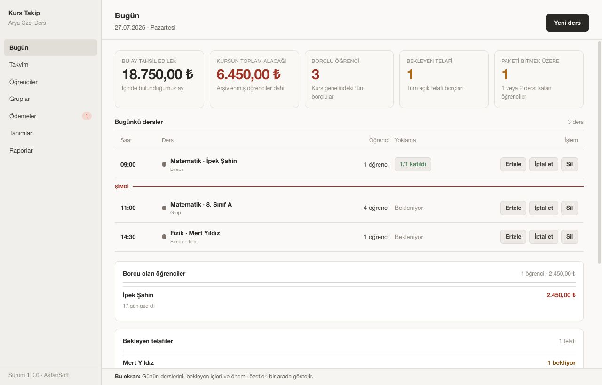

# Kurs Takip — Kullanım Kılavuzu

Kurs Takip dört soruyu hızlı cevaplamak için hazırlanmıştır:

1. Bugün kimin dersi var?
2. Kim geldi, kim gelmedi?
3. Kim ne kadar borçlu?
4. Kimin ders hakkı bitiyor?

## Her sabah — Bugün ekranı

Program açıldığında doğrudan Bugün ekranı gelir. Üstte aylık tahsilat, toplam alacak,
borçlu öğrenci, bekleyen telafi ve bitmek üzere olan paket sayıları bulunur. Altında
günün dersleri saat sırasıyla gösterilir.

- Kırmızı **Şimdi** çizgisi geçmiş ve gelecek dersleri ayırır.
- Yoklaması alınmış dersin katılım sonucu görünür.
- Sağ taraftaki bölümlerde borçlular, bekleyen telafiler, biten paketler ve son yedek
  bilgisi yer alır.
- Özet kutularına tıklayarak ilgili ekrana geçebilirsiniz.

Günün dersi görünmüyorsa önce haftalık programın oluşturulduğunu kontrol edin.

## Her ders sonrası — Yoklama

1. Bugün ekranında dersin **Yoklama al** düğmesine basın.
2. Her öğrenci için Geldi, Mazeretli, Mazeretsiz veya İptal durumunu seçin.
3. Herkes geldiyse **Hepsi geldi** düğmesini kullanın.
4. Kaydetmeden önce ders hakkı ve borç etkisini okuyun.
5. **Kaydet** düğmesine bir kez basın ve başarı bildirimini bekleyin.

Mazeretli öğrenci için telafi hakkı doğarsa aynı paneldeki **Telafi planla** kısayolunu
kullanın. Telafi dersi ayrıca ücret veya ders hakkı düşürmez.

## Hafta içinde — Yeni öğrenci

1. Soldaki menüden **Öğrenciler** bölümünü açın.
2. **Yeni öğrenci** düğmesine basın.
3. Ad soyadı yazın. Okul, sınıf ve öğrenci telefonu daha sonra tamamlanabilir.
4. Veli adını ve telefonunu aynı formda girin.
5. Kardeşi zaten kayıtlıysa **Mevcut veliyi bul** ile aynı veliyi seçin.
6. Kaydedin.

Öğrenci kaydından sonra uygun branş ve tarifeyle kayıt ya da paket işlemini tamamlayın.

## Hafta içinde — Ders ekleme ve program değişikliği

Yeni ders için Bugün ekranındaki **Yeni ders** düğmesini veya Takvim ekranını kullanın.
Öğrenci ya da grubu, branşı, öğretmeni, tarih ve saati seçip kaydedin.

Tekrarlanan bir dersi değiştirirken program size iki seçenek sunar:

- **Sadece bu ders:** Yalnız seçtiğiniz tarih değişir.
- **Bu ve sonraki dersler:** Gelecek program değişir; geçmiş dersler olduğu gibi kalır.

Tatil gününe ders konulamaz. Aynı öğretmene aynı saatte iki ders denk gelirse program
uyarır ve karar vermenizi ister.

## Ay sonu — Borçları kontrol etme

1. Soldaki menüden **Ödemeler** bölümünü açın.
2. Gecikmiş, bu ay vadesi gelen veya avansı olan öğrencileri süzün.
3. Öğrenci satırında borç tutarını, veli telefonunu ve gecikme gününü kontrol edin.
4. Listenin altındaki toplam alacağı not edin.

Borçlu listesi boşsa bu iyi haberdir; tahsil edilmemiş borç yoktur.

## Ay sonu — Tahsilat alma

1. Ödemeler, Öğrenciler veya öğrenci detayı ekranından **Tahsilat al** düğmesine basın.
2. Öğrenciyi ve tutarı seçin.
3. Nakit, Kart veya Havale yöntemini işaretleyin.
4. Programın en eski borçtan başlayarak önerdiği dağılımı kontrol edin.
5. Artan tutar varsa öğrencinin avansı olarak kalacağını okuyun.
6. **Kaydet** düğmesine bir kez basın ve başarı bildirimini bekleyin.

Yanlış tahsilat silinmez. **Tahsilatı iptal et** işlemi karşı kayıt oluşturur ve makbuzu
iptal olarak işaretler.

## Ay sonu — Makbuz ve cari ekstre

Tahsilattan sonra **Makbuz yazdır** ile Türkçe karakterleri düzgün gösteren PDF makbuz
oluşturabilirsiniz. Yazdırma penceresinde doğru yazıcıyı seçin.

Bir öğrencinin borcunun nedenini görmek için öğrenci detayındaki **Cari ekstre** bölümünü
açın. Tarih aralığını seçerek borç, alacak ve yürüyen bakiyeyi inceleyin.

**Excel’e aktar** dosyasını Excel ile açtığınızda öğrenci adlarındaki `İ`, `ı`, `ğ` ve
`ş` karakterleri düzgün görünmelidir.

## Dönem başı — Hazırlık sırası

Yeni dönem hazırlığını şu sırada yapın:

1. Tanımlar → Branşlar
2. Tanımlar → Tarifeler
3. Tanımlar → Öğretmenler
4. Gruplar → Yeni grup
5. Haftalık ders programı
6. Öğrenci kayıtları
7. Paket satışları ve taksit planları

Tarife fiyatını değiştirmek eski dersleri ve eski borçları değiştirmez. Kullanılmış
branş, tarife ve gruplar silinmez; **Arşivle** ile yeni işlemlerden kaldırılır.

Paket satarken ders sayısını, toplamı ve taksit vadelerini kaydetmeden önce özet
ekranından kontrol edin. Peşin ödeme de tek vadeli bir plan olarak girilir.

## Haftalık rutin

Haftanın ilk iş gününde:

- Takvimde öğretmen ve ders çakışmalarını kontrol edin.
- Bekleyen telafileri uygun günlere yerleştirin.
- İki veya daha az hakkı kalan öğrenciler için paket görüşmesi yapın.
- Yedekleme ekranında son yedeğin başarılı olduğunu kontrol edin.
- Son yedeği USB belleğe veya başka bir bilgisayara kopyalayın.

## Aylık rutin

Ayın son iş gününde:

- Ödemeler ekranında gecikmiş ve bu ay vadeli borçları kontrol edin.
- Tahsilatları alın ve gereken makbuzları yazdırın.
- Raporlar ekranında aylık tahsilatı, işlenen dersleri ve devam oranını inceleyin.
- Devamsızlığı yüksek öğrencileri veli görüşmesi için not edin.
- Cari ekstreleri gerektiğinde Excel’e aktarın.
- Ay sonu yedeğini ayrıca USB belleğe kopyalayın.

## Yedekleme ve geri yükleme

Program günlük yedeği otomatik alır. Elle yedek veya dış kopya için
[kurulum kılavuzundaki yedekleme bölümünü](KURULUM.md#yedek-alma) izleyin.

Geri yükleme mevcut verileri seçtiğiniz tarihteki hâline döndürür. Dosyanın tarihini
kontrol etmeden iki onayı vermeyin.

## Hata olduğunda

- Mesajdaki öneriyi uygulayıp **Tekrar dene** düğmesine basın.
- Programın başka bir penceresi açıksa onu kapatın.
- Disk doluysa yer açın.
- **Ayrıntıları kopyala** düğmesi görünürse metni AktanSoft’a gönderin.
- Veritabanının açılamadığı söylenirse son sağlam yedeği seçmeden önce destek isteyin.
