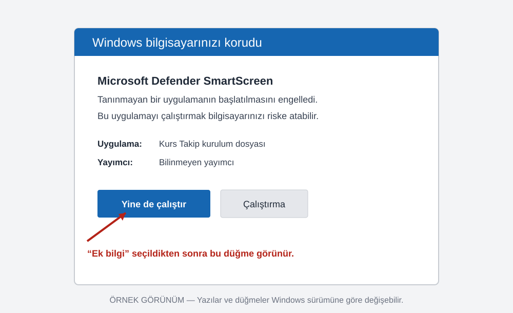
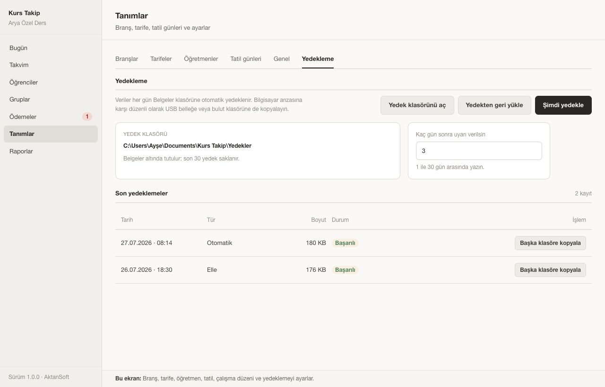

# Kurs Takip — Kurulum ve İlk Açılış

Bu kılavuz Windows 10 ve Windows 11 içindir. Program tek bilgisayarda çalışır; internet
bağlantısı ve kullanıcı hesabı istemez.

## Kurulum dosyasını indirme

1. [Kurs Takip indirme sayfasını](https://github.com/mehmetaktan/kurs/releases) açın.
2. En üstteki sürümün altında adı `.msi` ile biten Windows kurulum dosyasına tıklayın.
3. İndirme tamamlanınca dosyayı açın.

Kurulum dosyasını yalnızca yukarıdaki sayfadan veya size doğrudan AktanSoft tarafından
verilen bellekten alın. E-posta ya da mesajla gelen, kaynağını bilmediğiniz kopyaları
açmayın.

## Windows uyarı gösterirse

Program imzalı olmadığı için Windows ilk kurulumda “Windows bilgisayarınızı korudu”
uyarısını gösterebilir. Bu, tek başına virüs bulunduğu anlamına gelmez; Windows dosyayı
henüz tanımadığını söylüyordur.

> Görsel örnektir. Yazılar ve düğmeler Windows sürümüne göre biraz değişebilir.

Dosyayı yukarıdaki resmi indirme sayfasından aldıysanız:

1. Önce **Ek bilgi** bağlantısına tıklayın.
2. Açılan bölümde uygulama adının Kurs Takip olduğunu kontrol edin.
3. **Yine de çalıştır** düğmesine tıklayın.

**Yine de çalıştır** seçeneği görünmüyorsa Windows güvenliğini kapatmayın. Kurulumu
durdurun ve AktanSoft’tan yardım isteyin.

## Kurulumu tamamlama

1. Kurulum penceresinde **İleri** düğmesiyle devam edin.
2. Windows izin isterse **Evet** seçin.
3. Kurulum bitince Başlat menüsünden **Kurs Takip** uygulamasını açın.

Bilgisayarınızda gerekli görüntü bileşeni yoksa kurulum dosyası onu da yanında getirir.
Bu nedenle ilk kurulum internet olmadan tamamlanabilir ve normalden biraz uzun sürebilir.

## İlk açılış

İlk açılışta karşılama penceresi görünür.

1. Kurs adını kontrol edin.
2. **Kurs adı doğru, devam et** düğmesine basın.
3. İlk branşın adını yazıp kaydedin.
4. **Yeni öğrenci formunu aç** düğmesine basın.
5. Öğrencinin adını ve veli bilgilerini girip kaydedin.

İlk öğrenciden sonra Tanımlar bölümünden öğretmen, tarife, tatil ve çalışma düzenini;
Gruplar bölümünden grupları; Takvim bölümünden haftalık ders programını hazırlayın.

## Yedek alma

Program her gün Belgeler klasörü altında otomatik yedek alır. Bilgisayar arızasına karşı
haftada en az bir kez bu yedeği USB belleğe veya başka bir bilgisayara kopyalayın.

1. Soldaki menüden **Tanımlar** bölümünü açın.
2. **Yedekleme** sekmesine geçin.
3. **Şimdi yedekle** düğmesine basın.
4. Son yedek satırındaki **Başka klasöre kopyala** düğmesini kullanıp USB belleği seçin.

Yedek klasörünü görmek için **Yedek klasörünü aç** düğmesini kullanabilirsiniz.

## Yedekten geri dönme

Bu işlemi yalnızca yanlışlıkla veri kaybettiğinizde veya destek ekibi önerdiğinde yapın.

1. Tanımlar → Yedekleme bölümünde **Yedekten geri yükle** düğmesine basın.
2. Tarihine bakarak doğru yedek dosyasını seçin.
3. Programın gösterdiği iki ayrı uyarıyı okuyup onaylayın.

Program geri dönmeden önce o anki verilerinizi ayrıca yedekler. İşlem bitene kadar
programı ve bilgisayarı kapatmayın.

## Güncelleme veya yeniden kurma

Yeni sürümü mevcut programın üzerine kurabilirsiniz. Öğrenci ve ödeme kayıtları kurulum
klasöründe tutulmadığı için normal güncellemede korunur. Yine de güncellemeden önce
**Şimdi yedekle** deyip yedeği USB belleğe kopyalayın.

## Yardım isterken

Bir hata penceresinde **Ayrıntıları kopyala** düğmesi varsa düğmeye basın ve kopyalanan
metni AktanSoft’a gönderin. Öğrenci veya ödeme ekranının fotoğrafını göndermeden önce
kişisel bilgilerin görünmediğini kontrol edin.
